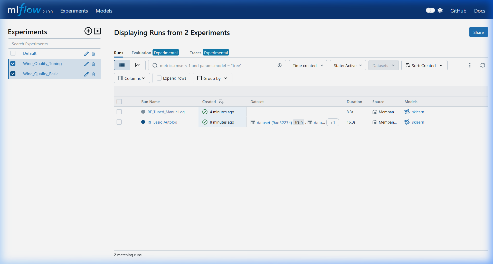
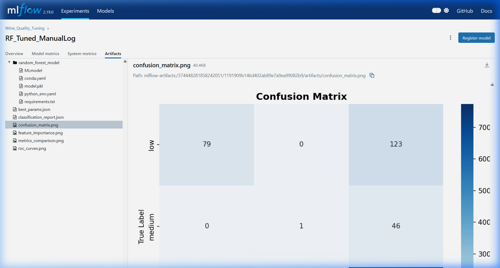

# Membangun Model Machine Learning - Wine Quality MLOps

## Deskripsi
Repository ini berisi proses pembangunan model Machine Learning untuk prediksi kualitas wine menggunakan MLflow dan DagsHub.

## Struktur
```
+-- modelling.py               # Script training dasar
+-- modelling_tuning.py        # Script hyperparameter tuning
+-- requirements.txt           # Dependencies
+-- DagsHub.txt                # Link DagsHub repository
+-- wine_quality_preprocessing/ # Dataset preprocessing
+-- screenshoot_artifak.jpg    # Bukti MLflow artifacts
+-- screenshoot_dashboard.jpg  # Bukti MLflow dashboard
```

## Model
- **Algorithm**: Random Forest Classifier
- **Framework**: MLflow + scikit-learn
- **Tracking**: DagsHub MLflow server

## DagsHub
Link: [ardiradi/Wine-Quality-MLOps](https://dagshub.com/ardiradi/Wine-Quality-MLOps)

## Bukti Screenshots
- MLflow Dashboard: 
- MLflow Artifacts: 

## Cara Menjalankan
```bash
pip install -r requirements.txt
python modelling_tuning.py --dagshub
```
